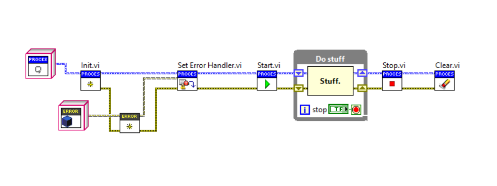

# Introduction to Triarc Framework

This document gives a brief introduction to and a high level overview of the Triarc Framework (`TF`).
The framework is developed and maintained by Astemes and is released under and open source license. 

## What is Triarc Framework

The framework is an application framework useful for developing concurrent applications in LabVIEW
Core abstractions for `Processes`, `Applications`, and `Views` are provided by the framework.
These may be extended to implement sophisticated applications. 

The framework provides communication channels between processes and manages their lifecycles.
Boilerplate for error handling, logging and configuration management is also provided by the framework.

The API to a `TF` process is similar to the API of an instrument driver, and should for this reason feel familiar to any LabVIEW developer.
An example is shown below, where the active lifecycle of the process would be during the while loop.
From within the while loop, the user of the process would interract with it using API calls. 

`TF` is based on the proven actor model, which is a very powerful way of managing distributed processing.
The design goal of `TF` is to provide all the benefits of an actor based system, while maintaining a simple API and reducing unnecessary complexity. 

The design is test driven, and because of this modules built on `TF` are testable and may be created to adhere to SOLID design principles.

## Why Yet Another Framework?

There are well established frameworks available in the LabVIEW ecosystem, most notably NI Actor Framework and DQMH.
Each of these have their own benefits and drawbacks, but neither seemed to fit well for our needs and workflow. 
Thus a test rig architecture grew through and after a few incarnations, a generic high level framework could be extracted, to be further distilled, tested and improved.

Triarc processes are composable, independent, and testable.
The framework encourages modularity and allows for composition of applications out of smaller single responsibility processes.
Robust communication is implemented and each process life cycle is managed by the framework.
Entry points are provided by the framework for error handling and logging, and a powerfull debugger is available.

Even if there might not be a great demand for a new framework, there was no reason to keep Triarc private or closed.
By releasing it as open source, proper version management is enforced and publicly available.
Releasing it as open source is valueable for all users of the framework and gives room for anyone to contribute both ideas and code.
