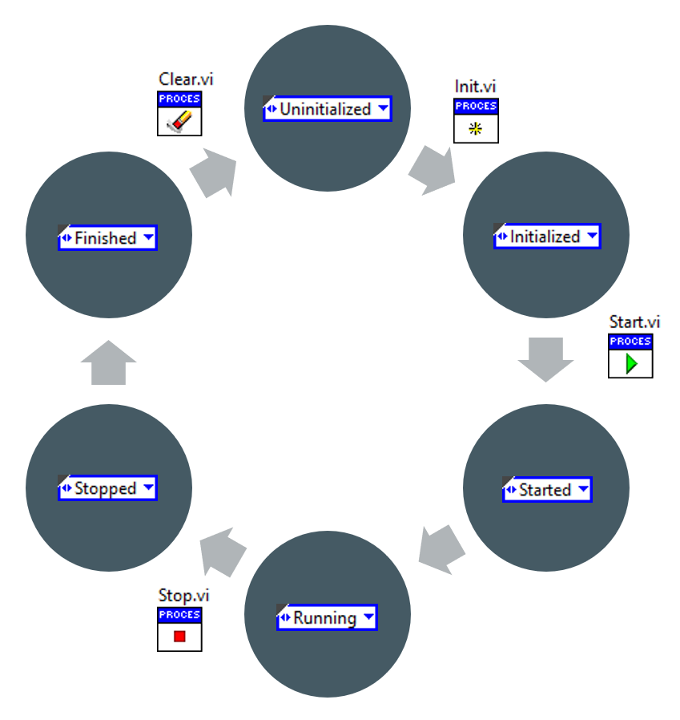
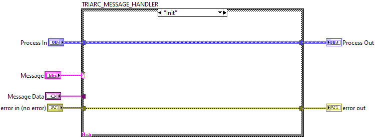
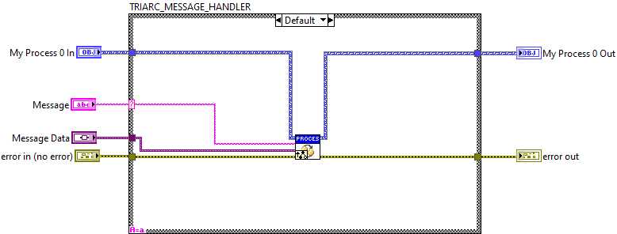

# Process

The `Process` is the fundamental building block of a Triarc application, similar to an actor in Actor Framework or a DQMH Module in DQMH.

## Process Life Cycle

The framework maintains information on the lifecycle state of the process, which changes as the process changes state during execution of the application.
The lifecycle state is a core concept which is used to ensure internal consistency of the framework.
The evolution of the lifecycle is shown in the following image.

The process will always start as `Uninitialized` when created and move to the `Initialized` state when the `Init.vi` method is called.
The `Init.vi` is a dynamic dispatch method which should be used to allocate any resources and open references used by the process.
When the process is started, the main processing loop is launched asynchronously.
The `Start.vi` method waits for the process to have handled the `Start` message and reached the `Running` state before resuming execution.
The process lives its own life in the process loop until it is stopped by calling the `Stop.vi` method. 
The `Stop.vi` method also waits for the process to finish executing before resuming execution.
Once finished, the process may either be restarted or cleared to release any resources allocated during initialization.

The framework provides methods for reading the current lifecycle of the process or wait for a specific lifecycle state.

## The Process Loop

When a `Process` is started, the process loop is launched asynchronously.
Each `Process` maintains its own state and state data in the Process Loop.
A very important principle is that the state data may only be accessed from within the Process Loop.
There is no limitation on the number of processes running concurrently and multiple processes of the same class may be started in parallell without limitations.

The process loop is esentially a queued message handler which receives messages enqueued by API-methods and passes them to a `Handle Messages.vi` method. 
The VI containing the process is private to the framework and may not be changed by a developer using the framework.
To implement functionality into a process, the `Handle Messages.vi` is overridden.

The framework implements functionality in the process for debugging, logging and error handling.

## The `Handle Messages.vi`

To make a process do something interesting, the `Handle Messages.vi` should be overridden and implemented.
The VI is called in the Process Loop whenever a message is received and by implementing the cases of the case structure, the behavior is defined.
The process data should only be accessed within the `Handle Messages.vi` and this makes it safe to read and update the data without risks for race conditions.

The Default case of the case structure of the `Handle Messages.vi` should always call the `Call Parent Class Method.vi` to pass any unhandled message to the parent.
This makes the message handling logic very DRY and only the specific responsibility of the `Process` is present in the message handler.
As the number of cases in a `Handle Messages.vi` is typically rather small, the readability is often good.

## The `Read Configuration.vi`

Configuration management is a central issue for most test systems, and for this reason configuration management is part of the framework.
The `Read Configuration.vì` is a dynamic dispatch VI which may be overridden to load default configurations.
The VI is called by the framework when the process is initialized.

## Process Context

When a process is added to an application, the process is aware of its context.
If process A is added to application B, then B is the context of A.
If application B is further nested in applcation C, the context of A is still B, but the context of B is C.
If application C is the top level application, it does not have a context.

Tracking the context of a process is usefull as it allows for communicating from the process back to the caller.
To make the communication useful, the process will need to make some assertions on the context in which it runs, *e.g.* that it implements a given interface.