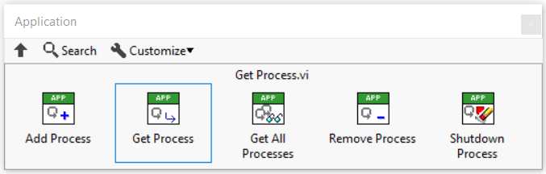

# Application

A computer program is typically composed of many small processes handling the different responsibilities and behaviors of the application.
In Triarc `Processes` are composed in `Applications`.

## The Triarc Application

The `Application` is a class derived from the `Process` class.
The purpose of the `Application` is to manage the lifecycle of other processes.
The `Application` has an API as shown below, and also inherits the API of the `Process`.

`Processes` are added to an applicaiton using the API VI called `Add Process.vi`, and may subsequently be retrieved from the `Application` using the `Get Process.vi`.
Each `Process` can access its owning `Application` using the `Get Context.vi`.

As the `Application` is itself a `Process`, there is nothing preventing nesting applications.
This enables creation of rich architectures with layers of sub systems. 

## Lifecycle Management

An application is responsible for its owned processes and the processes follow the lifecycle of the application.
If the application is started or stopped, all its owned processes changes lifecycle states in the same way.
Processes added while the application is running are not started automatically, which enables idle processes to be added to an application.

## Recursion through the Application

The `Application` does apply certain operaitons recursively through its owned processes.
This applies also in general for nested applications.

When a `Process` is added to an `Application` the lifecycle of the process is managed by the application.
This means that if the owning `Application` is *e.g.* stopped, all `Processes` within the `Application` will also be stopped.

Similarly, configuring an `Error Handler` or a `Log Handler` for an `Application` will configure the handler for all owned `Processes`.
