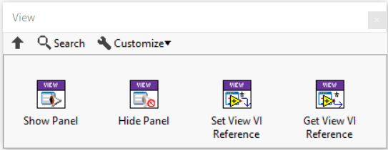
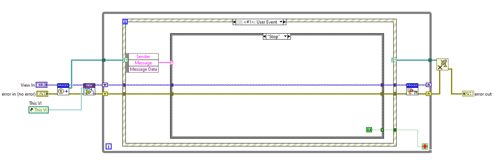

# View

A Triarc `Process` is a headless process running without a user interface.
While indicators may be added to the `Handle Messages.vi` for debugging, this is not recommended for implementing a user interface.
The derived `View` class adds a user interface to the process.
This VI should be used to implement a user interface component and complex user interfaces are typically composed from multiple small views inserted in sub panels.

## Anatomy of a View

The `View` class adds a VI called `View.vi` and provides methods for showing and hiding the panel of the `View.vi`.
The API also provides a method for getting a reference to the `View.vi`, which may be used to insert the `View` into a subpanel.
The API is shown below.

There are two requiremetns that the framework asserts on the `View.vi` and it is important that these are fulfilled.
The first is that the `View.vi` reports a refrence to the VI when it is started using the provided framework method.
The second requirement is that the `View.vi` stops when the `Stop` message is broadcasted.
This is demonstrated below.

## Communicating between the Process and the View

The `View.vi` and `Handle Messages.vi` runs concurrently and in separate VIs with some given communcation channels.

When a user interacts with the view, the view may call any API method on the process to send messages to the process loop.
As the `View.vi` belongs to the process, the API may even be privately scoped.

Communicating from hte `Handle Messages.vi` in the process loop to the `View.vi` is typically done using broadcasts.
Broadcast messages are sent from the process loop and handled by the `View.vi` to update the user interface.

Another way of updating the user interface is to send references from the `View.vi` to indicators and then update these indicators using property nodes in the `Handle Messages.vi`.
