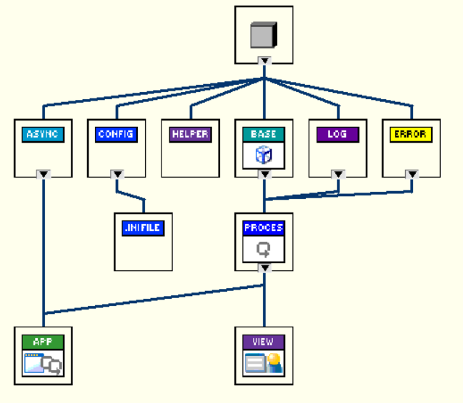

# Framework Architecture

This document describes the architecture and the dependencies between the core components of the Triarc Framework (`TF`).
The hirarchy of the core classes and interfaces are shown below.

## Framework classes

The framework classes are the starting point for every Triarc module.
They are responsible for handling the lifecycle of the processes in the application as composable modules.

## Framework Interfaces

The framework interfaces may be used to decorate a framework class and add additional behavior.
As an example, adding a `Configuration File` interface to a class makes it configurable through the API defined by the interface.
