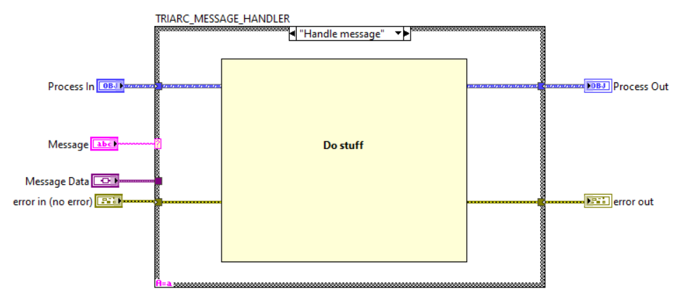

# Handling Messages

Messages are sent by users (not necessarily human users) of the process by making API calls on the process wire.
All messages are enqueued with the same priority to a the process loop where they are received and fed to the `Handle Messages.vi`.
This VI is the core of any process.

## The `Handle Messages.vi`

The `Handle Message.vi` is called from within the process loop and receives every message sent to the process throug the API.
It may be thought of as a subVI containing only the case structure in a traditional LabVIEW Queued Message Handler.
As seen below, the `Handle Messages.vi` receives the message string and the message data variant and has access to the process wire.

A very important rule in Triarc is that the `Handle Messages.vi` is the only place where the data in the class wire is accessible and valid.
In other words, this is the only place where the class wire may be unbundled or bundled.

## Overriding Messages

Since every message is passed to the `Handle Messages.vi`, it will also receive messages defiend by super classes of the specific process.
The normal behavior is to invoke the `Call Parent Class Method.vi` in the default case and let the parent take care of the message.
It is however possible to override the behavior and handle or add logic to API calls of parent processes.
