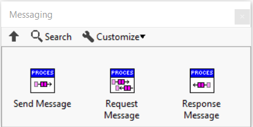

# Messaging

The main communication channel in Triarc is based on message passing to a process.

## The Messaging API

The messaging API is relatively simple, as seen below.

There is no priority levels to be configured and messages are received in the order they are sent.
Additionally, the method for receiving messages is private to the `Process` class and is only used in the process loop.

## Messaging throught the Lifecycle

Messages may be sent both while a process is running and before it is started.
Messages sent before starting a process will not be handled before starting the process.

When the process starts, the first message to be handled is always the framework defined `Init` message.
After this all messages sent before starting the process is handled, and then the `Start` message is handled.

When stopping a process, a `Stop` message is sent.
Messages sent after calling the `Stop.vi` method, but before the `Stop` message is handled will be handled before the process finishes.
This is meant to allow for controlled and clean stopping of the process and if the process must be terminated quickly, the `Clear.vi` guarantees immediate termination.

If a process is stopped, it is still possible to send messages to it, but these will not be handled unless the process is started again.

## Type safety

Message specification is restricted to the class handling the messages.
The fact that the messaging VI:s are protected enforces the process to implement an API VI which enqueues the message and this VI should in general hard code the message string and enforce the expected data type for the message data.
This pattern protects from misstyping the message string and ensures the expected data type is sent.
It also enforces a clear and robust API to be defined, which is useful for both testing and readability.

## Sending Messages

A regular message is sent to the process using the `Send Message.vi` and the message is received in the Handle Messages VI of the process.
Upon receiving a message the process may execute some logic, change its state data, launch new processes, broadcast a message, and so on.
In general the message handling should be atomic, implementing the full functionality in one of the cases of `Handle Messages.vi`.
