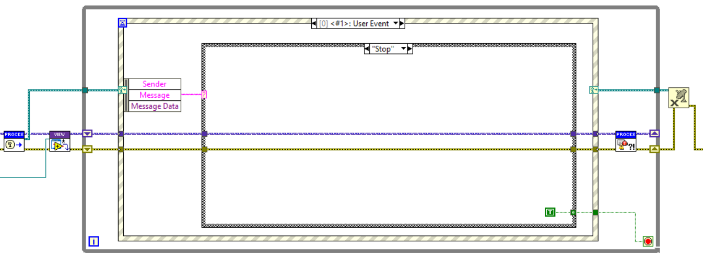

# Broadcasting

Broadcasting is a communication channel used for sending one to many type of messages.

## Implementation using User Events

The transport mechanism for broadcast messages is based on User Events with a fixed data type.
The creation of the broadcast User Event reference and event registration is managed by framework methods.
To register for broadcasts from a process, use the `Register for Broadcast Events.vi`.
There is also a method available to recursively register for all processes within an `Application` called `Register for Broadcast Events Recursively.vi`..

To receive broadcasts, an event structure should be used as shown above.