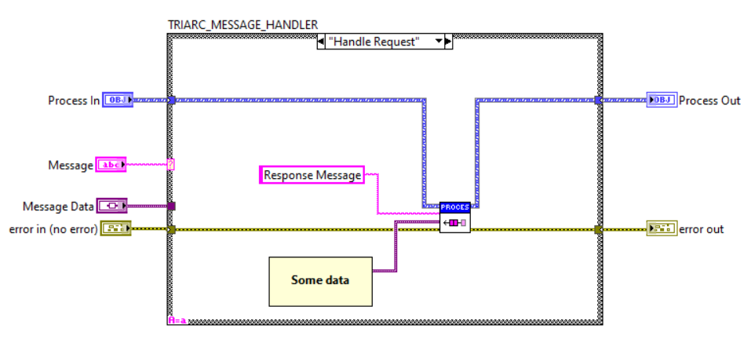

# Requests and Responses

The Triarc framework consists of processes running independently which communicates through exchanging messages.
The framework provides a broadcasting communication channel, which may be used to broadcast results from handling a message.
In addition there is also the request message type which may be used to do blocking and non-blocking requests as described below.

## Synchronous Requests and Response

Sometimes it is useful to make syncornous requests to a process.
If something should be returned from the process to the sender of a message, the `Request Message.vi` may be used.
The process receiving the request must call the `Response Message.vi` to return a response to the requestor and it must be called from the case in the Handle Messages VI which handles this specific message.
This is shown in the image below.

Requesting something from a process is a serialized operation, meaning that the Request Message VI will block the execution until either a response is returned or the timeout has expired.
If a request is made from within another process, this process will be stuck waiting for the reply and cannot respond to, or handle, any other messages while waiting for the response.
This in turn introduces risks for deadlocks and other quirks of concurrent systems, so requests should be used with care.

The Triarc request-response pattern is a less tightly coupled solution because the request and response responsibility is implemented completely in the responding process class which exposes the request API call.
Changing the implementation only requires changes to the responding class as long as the returned data type reamins unchanged.
And if the type needs changing, it will cause a compile-time error which mitigates the risk of introducing bugs.

## Asynchronous Requests

In some cases a synchronous request is acceptable, or even desireable, but there are many situations where a blocking wait for response is unacceptable.
The recommended way of solving this in the Triarc framework is by using the `Async Request Message.vi` introduced in version 1.1.0. 
The `Async Request Message.vi` takes, in addition to the regular Message string and Message Data variant, a `Callback` interface.
When the `Response Message.vi` is called from the process loop, the `Callback.vi` of the class, provided when calling `Async Request Message.vi`, is fired.
This is a very powerful way of implementing requests, as it does not directly couple the callee to the caller.
It is important to note that there is an indirect coupling, *i.e.* if data or formating of the response changes, it may breake the function of caller.

## Asynchronous Requests prior to Version 1.1.0

An asynchronous action runs in parallell to the process and is useful for dispatching requests without blocking the process.
To implement an asynchronous request, the request API VI is placed in the Helper Action VI, and when the request needs to be dispatched, the Launch Asynchronous Action VI is called.
The request is in this scenario running assynchronously to the process and it is even possible to have the same process dispatch several concurrent asynchronous actions waiting for different requests.

When the response eventually returns, the response message is received in the Async Action VI and may be forwarded to the main process as regular message or a process internal message.
It is important to note that the asynchronous action is outside the process loop and cannot directly change the state of the process, but it may enqueue messages to the process which updates the state.
Another caveat is that a change in state in the process will not be propagated to a running action.
In order to propagate any state chnage to a running asynchronous action, it must be restarted from within the process loop.
An important virtue of this implementation is that the protection of the message queue is preserved and the requesting class decides what message is sent to its process when the response is returned.
