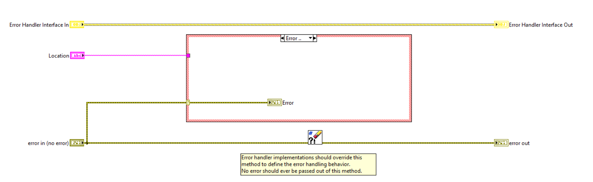

# Error Handling

Error handling is important for building reliable systems.
Triarc provides very flexible error handling by delegating error handling to a user specified error handler.

## Implementing and Error Handler

To implement an error handler, it is necessary to create a class which implements the `Error Handler Interface` provided by the framework.
The interface requires the implementer to override the `Handle Errors.vi` to implement the error handling logic.

Error handling may be invoked by calling the `Handle Errors.vi` on a process wire (as the Process class implements this interface).
The actual handling of the error is delegated to the configured error handler.

## Setting an Error Handler

An error handler may be configured for a process using hte `Set Error Handler` VI.
This works recursively for processes within an application, regardless of wheter the process was added to the application before or after the error handler was configured.

After setting the error handler, any error occuring within the process loop will be delegated to the `Handle Errors.vi` of the configured error handler.
This makes it possible for an error handler, which *e.g.* displays any occuring error while testing, to be replaced by something more appropriate for production.

## Logging Errors 

The concepts of error handling and logging ar separated in Triarc and an error handler should in most cases not be responsible for logging errors.
This responsibility should be implemented by a log handler.
