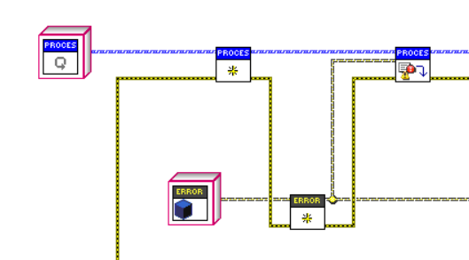

# Error Handling

Error handling is important for building reliable systems.
Triarc provides very flexible error handling mechanism by delegating error handling to a user specified error handler.

## Implementing and Error Handler

To implement an error handler, it is necessary to create a class which implements the `Error Handler Interface` provided by the framework.
The interface requires the implementer to override the `Handle Errors.vi` to implement the error handling logic.

## Error Handling in the Process 

The Process class also derives from the `Error Handler Interface`, but the actual handling of the error is delegated to the configured error handler.
In this way, error handling may be invoked by calling the `Handle Errors.vi` on any process wire.

The `Location` input to the `Handle Errors.vi` is used to specify where the error occured.
When an error occurs within the `Handle Messages.vi` of a process, the location contains the qualified name of the process followed by the message handled while encountering the error.

## Setting an Error Handler

An error handler may be configured for a process using hte `Set Error Handler` VI.
This works recursively for processes within an application, regardless of wheter the process was added to the application before or after the error handler was configured.

After setting the error handler, any error occuring within the process loop will be delegated to the `Handle Errors.vi` of the configured error handler.
This makes it possible for an error handler, which *e.g.* displays any occuring error while testing, to be replaced by something more appropriate for production.

## Error Handling in an Application

When the `Handle Errors.vi` of a Process is called, the error handling is delegated to the error handler configured using the `Set Error Handler.vi`.
If an error handler has not been set for the process, the error handling is delegated to the context of the process.
This means that the error is passed to the `Application` which owns the Process and delegated to its configured error handler.
This happens recursively through the process tree and the first context which has an error handler configured will handle the error.
This means that it is enough to configure the error handler only for the top level `Application` and all processes in the hierarchy will delegate error handling to this error handler.
If a certain process needs to override the error handling, another error handler may be configured for this process and *e.g.* supervisors may be implemented.

## Logging Errors 

The concepts of error handling and logging are separated in Triarc and an error handler should in most cases not be responsible for logging errors.
The responsibility of logging should generally be implemented by a log handler, as it is often useful to know the context of errors occuring.
