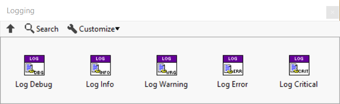

# Logging

Logging is very useful for gaining insight into a running system, both during development and when deployed.
Most modern programming languages provides the scaffolding for writing log information, but LabVIEW does not.
Triarc provides a powerful and flexible logging mechanism.

## Logging API
The logging API may be used with any Triarc Process and consists of VIs for logging messages with different severity levels. 

The Debug severity only logs if a conditionally disabled symbol `DEBUG=TRUE` is configured for the project, and should be used when debugging issues and logging detailed data.
The logged message will contain data on the process which called it.

## Framework events

The framework calls the logging API at certain events, such as starting and stopping processes.
These events are sent to the logger at the `INFO` severity level.
Errors and warningsa are sent to the logger by the framework as they occur and these will occur with the `WARNING` or `ERROR` severity levels.

## Handling Log Messages

What to be done with logged messages is up to the user of the framework.
The framework delegates the actual logging to a class implemeting the `Logging` interface.
The class handling the logging is configured using the `Add Log Handler.vi` and it is possible to have multiple log handlers configured concurrently.
The log handlers are configured recursively for processes within an application.

## Implementing a Log Handler

To implement a log handler, a class must be created which implements the `Logging` interface.
There is one method called `Log.vi` which must be overridden to define what to do with the event to be logged. 
Common implementations is to display the log in a text indicator or log the content to a file.

To see a basic demonstration of a log handler, see the Coffee Shop example application.

## Logging Severity

There are five levels of severity used by the logging framework.
These are available through static VI:s in the `Logging` interface and are called `Log Debug.vi`,`Log Info.vi`,`Log Warning.vi`,`Log Error.vi`, and `Log Critical.vi`.

The Triarc Process implements the logging functionality by delegating to the configured log handler.
The events are filtered by the process class and a log handler should only log the different levels of events without further filtering.
The meaning of the levels in the context of a Triarc Process is as follows.

- `DEBUG` - Event is only logged if the `DEBUG==True` conditional disabled symbol is configured in the project.
- `INFO` - Events containing information that the application is running as expected. If an error occurs upstreams from the `Log Info.vi`, the logging will be ignored.
- `WARNING` - This event is invoked if a warning (error cluster with status == False and non-zero error code) occurs within the process.
- `ERROR` - Invoked when an error occurs in the process and should be used to log errors.
- `CRITICAL` - Invoked if called with an uppstreams error. Not used by the framework.

## Framework Log Events

If the `DEBUG` conditional disabled symbol is set to `True` the framework will log every message in the order they are received.

The framework passes warnings and errors occuring in the process loop to the configured log handlers.

Additionally the following life cycle changes are logged as `INFO` level messages.

- `Started` - Log entry made when process started
- `Running` - Log entry made when process has executed the `Start` state
- `Stopped` - Log entry made when process stopped
- `Finished` - Log entry made when process finished

These events are useful as it allows for determination of wether errors and other events occurs during startup, execution on shutdown of the process.
