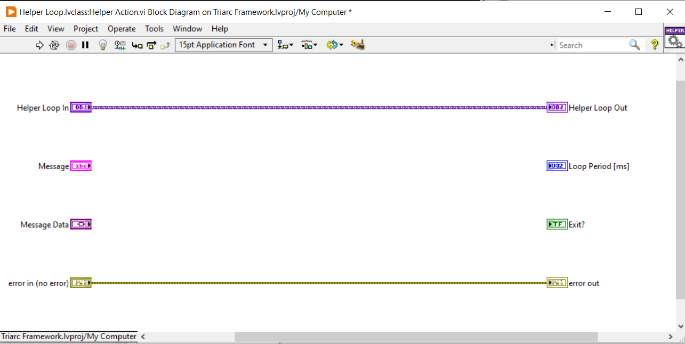
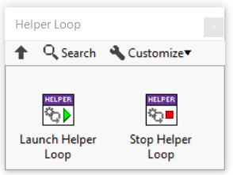

# Helper Loops

A common pattern in LabVIEW is the useage of helper loops to handle periodic tasks.
Triarc provides a generic implementation for running helper loops and managing the lifecycle.

## Use cases

There are often use cases where a task needs to be done periodically.
Examples of this could be making a software timed measurement, reading from a buffer, or reconnecting to a network service.
This could in principle be solved by re-sending the same message over and over to the process, but doing so has drawbacks and timing limitations.
A better way of solving this is to use a helper loop running in parallell to the process.

## Using a Helper Loop

To add one or many helper loops to a process, the host process should be configured to implement the `Helper Loop` interface.
The interface requires the implementation of a dynamic dispatch VI called `Helper Action.vi` which defines the action taken each iteration of the helper loop.
The `Helper Action.vi` is shown below.

When a helper loop is started, the `Helper Action.vi` will be called periodically with the period specified by the `Loop Period [ms]` indicator.
The loop runs until the `Exit?` indicator is set to `True` or an error is passed out of the `Helper Action.vi`.

## Launching a Helper Loop

To launch a helper loop from within the host process `Handle Messages.vi`, one simply calls the `Launch Helper Loop.vi`.
It is possible for one host process to have many helper loops running simultaneously.
The `Launch Helper Loop.vi` accepts a Message string and a Message Data variant, which may be used to paramterize helper loops and alter the helper behavior.

All helper loops are stopped by the framework when the process finishes or is cleared.
It is also possible to stop a running helper loop by calling the `Stop Helper Loops.vi`, shown in the palette above.
Note that VI stops all running helper loops, and there is no way to selectively stop helper loops provided by the framework.

## State Data

The `Helper Action.vi` has the class data flowing through it and values within the class data contains a snapshot of the state of the host process when the helper loop was started.
That means that the data in the helper loop will not be updated when the state of the host process changes, and if the helper loop needs access to updated data it must be restared.

Similarly, the state of the process cannot be changed from within the helper loop.
If data needs to be communicated back to the host process, regular API calls should be used.
