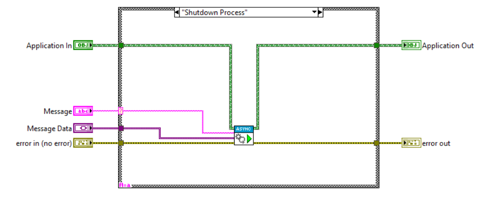

# Async Handler

Some messages may take a significant amount of time to process and it may be desireable for the process to remain responsive whild waiting for the handling of the message to finish.
In such cases, an Async Handler is useful as it makes it possible to handle the message asynchronously while the process remains responsive.

## Using an Async Handler

To add asynchronous handling to a process, the host process should implement the `Async Handler` and override the `Async Action.vi` to define an action.
To launch the asynchronous handler, call the `Launch Async Handler.vi`.
An example is shown below where the `Application` class lauches an asynchronous handler to shutdown a process.

