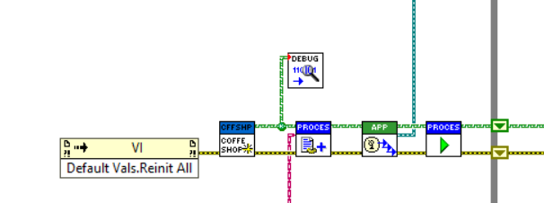
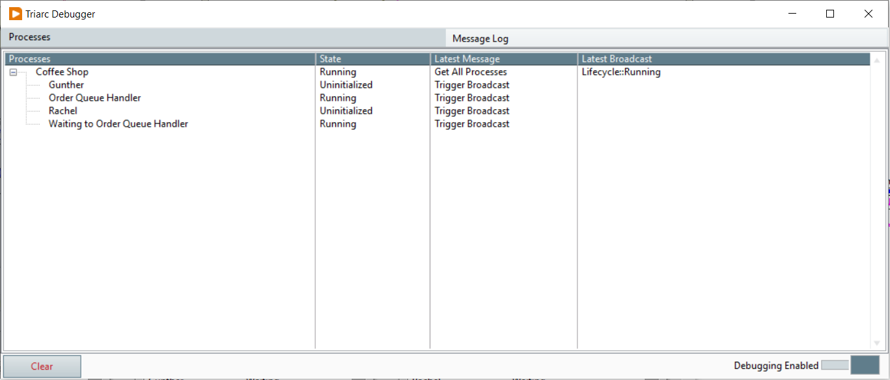
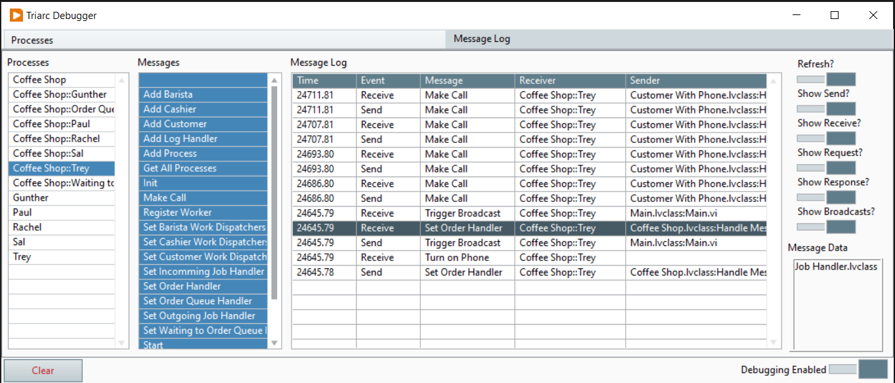

# Debugging
Triarc comes with a powerful debugger which enables viewing of messages in an application in real time.
The debugger is maintained in [its own repository](https://github.com/Astemes/astemes-triarc-debugger) and deployed in a separate VI Package which must be installed in order to use it.
While the debugger is an invaluable tool, overusing it should be avoided in favor of automated testing.

## Using the Debugger

To launch the debugger, in LabVIEW, select Tools -> Triarc -> Debugger.. and the Debugger window will load.
The debugger may also be launched by attaching it to the top level application, as shown below.
The `Attach Debugger.vi` is found in the palette under `Triarc Debugger`.
When the debugger is attached, it will also enable viewing of broadcasts from processes within the application.

To enable debugging, a `debug = TRUE` conditional disabled flag need to be set for the project.
This flag may be set directly from the debugger window using the switch in the lower right corner.
It is recommended to turn debugging of for deployment as the log level of the framework is increased and debugging adds a slight performance overhead.

## Process View

The Process View of shows all active processes, their state and the latest messages received.
By double clicking on a process, the `Handle Messages.vi` of the process is opened and may be debugged using regular LabVIEW debugging tools.
If the debugger was attached to the process or its owning application, broadcast messages will also be shown.

## Message View

The Message View shows a log of messages sent in the application in real time.
The message list may be filtered by process and by message, and further to only show *e.g* sent or received messages.
By selecting a message, the content of the Message Data variant may be seen in teh Message Data indicator.
Double clicking on a sent message will open the location the message was sent from and double clicking on a received message will open the receiving `Handle Messages.vi`.

