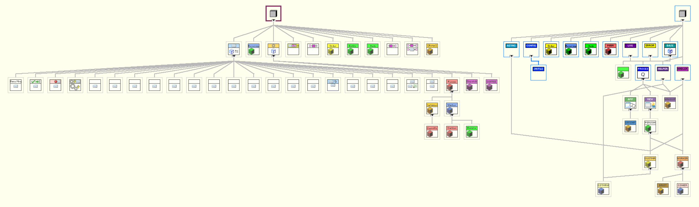

# Triarc and Actor Framework

LabVIEW has already existed for over 30 years and Triarc is not the first framework which has been proposed. Comparing frameworks is not a simple task as different frameworks have merits in different areas. There is simply no such thing as the best framework, it all comes down to who you ask. As of today, there are two frameworks which have achieved a somewhat broad user base. The first is NI Actor Framework is bundled with LabVIEW and is included in the installation of LabVIEW. The second is Delacor DQMH, which is an extenssion and improvement of the NI Queued Message Handler (QMH) template.

Disclaimer: I tend to be strongly opinionated and I am certainly biased, as I would not have created Triarc if I thought there was better alternatives out there for me.

## Brief Introduction to Actor Framework

The Actor Framework is bundled with LabVIEW since LabVIEW 2012 and is maintained by NI.
It implements an [actor model](https://en.wikipedia.org/wiki/Actor_model) with independent actors passing messages to each other asynchronously.
Each actor is a class overriding the base Actor class and multiple instances of the same actor may be instantiated.

Actors communicates by sending messages, which are objects.
The Do method of the message defines the action taken by the actor when the message is received and in contains the functionality of the actor.
The actor is fed as an input to the Do method of the message and may implement VIs used by the Do method.

As actors are classes, it is possible to create hierarchies of actors.
Each actor is able to handle its own messages, as well as messages defined for any of its parents.
The parents may allow child actors to override methods used in its messages to override the behavior.

From my own experience, actor framework is regarded as a powerful, yet very complex framework.
I would recommend at least a CLA level of LabVIEW experience before trying to use actor framework.

## Comparing Actor Framework to Triarc

Both Triarc and Actor Framework implements a version of the actor model and are for this reason very similar conceptually.
In Triarc the actors are however called processes to avoid confusion.

The main difference is that messages in Actor Framework are objects implementing the [command pattern](https://en.wikipedia.org/wiki/Command_pattern), while Triarc uses the string and variant message cluster used by the Queued Message Handler template.

This section will go through some of the design decissions in the two frameworks and how they differ.
For a better understanding, it is worth exploring the Coffee Shop example which ships with LabVIEW (called Actor Framework Fundamentals) and the counterpart implemented in Triarc.

### Messaging

Actor Framework messages are sent by obtaining a reference to the enqueuer for the receiving actor and calling the Send method with the enqueuer as input.
The enqueuer wire is a reference and cannot be unbundled to access the actor state outside the actor core process.

In Triarc messages are sent using the protected Enquque Message method.
This method should be wrapped in an API VI which builds the message and the API is then called on the class wire to send the message.
Conceptually the two are quite similar, as seen below.

In actor framework the messages may be either abstract or coupled to a specific actor class hierarchy.
An actor may allow its children to modify the bahvior of the Do method in a message by using dynamic dispatch methods which the children would then override.

In Triarc the same concept may be implemented by adding cases in the Handle Messages.vi for the specific message in decending classes.
An abstract message in Triarc is best implemented using an interface.

### Callbacks

One nice advantage of using objects as messages is the possibility for defining callbacks.
A message may be passed as a parameter to be called when a task is completed by another actor and the message may be forwareded between actors.
An example of this can be found in the Coffee Shop example where the cahier builds a callback message which is sent with the order item to the barista.
The barista fires the callback when the job is completed by sending the callback message.

To implement a callback in Triarc in a similar way, an interface must be created which the process handling the callback implements.
The Callback Message in the data of the order item is replaced by an interface which defines the callback method.
The callback message is sent by invoking the method defined by the interface.

Both methods works well and have the merit of decoupling the class making the callback from the class receiving it.
As an interface cannot cary any data, the beverage input is given by the barista in Triarc, while the cashier is setting it in Actor Framework when constructing the message.
In this example I think it makes more sense to have the barista set the order content to be picked up, but this is at the cost of slightly tighter coupling.
To achieve the same decoupling as in the Actor Framework example and make the barista unaware of the return message content, the cashier could implement a more abstract interface used by the barista and the cashier could notify the customer using and asynchronous action.

### Context awareness

In Actor Framework an actor may spawn nested actors, which may in turn spawn more actors.
Nested actors may be stopped by the calling actor when on shutdown and nested actors may send messages to their caller by accessing the Callers Enqueuer.

In Triarc there is a class called Application which hosts processes or nested applications.
Any process may access the application hosting it by using the Get Context method.

### User Interfaces

In Actor Framework it is common to implement the user interface in the Actor Core.vi.
Triarc introduces the concept of a View which implements a user interface component.
The View separates the user interface from the process and provides some of the common boiler plate code.

### Features

Actor Framework is more minimal than Triarc in the features available in the framework.
The framework is responsible for handling messaging between actors, the actor lifecycles, error handling and debugging.
Triarc provides more functioanlity, such as the View and Application classes, and the Helper Loop and Asynchrounous Action interfaces.
Triarc also has configuration persistance features built in and support for logging and predefined automated unit tests.

Whether the additional functionality in Triarc is an advantage or not depends on how useful you find the features.
Personally I have found that these are concepts needed for any project and should therefore be part of the framework.
These provided concepts enforces a certain style and structure to the code.

### Ease of Use

This might be an oppinionated section, but one may argue that ease of use is an important aspect of any framework.

Actor framework is heavily object oriented, and by heavily I mean that every actor and message is an object.
To determine what a specific actor does, you need to look at the actor class, then all messages for the specific actor and then all messages for all of its parent actors.
If there are dynamic dispatch VIs used in the messages, you need to go back and find which one is actually called, which depends on the specific class.
This might be a lot to diggest, even for experienced developers, and in my opinion it is unnecessarily complicated.

To send messages in Actor Framework you need to get access to the correct enqueuer and construct a message to be sent to the actor.
This paradigm and the overall design of the interfaces in actor framework makes it look and feel very different from other well known designs, such as the queued message handler.

Triarc on the other hand is modelled after well known concepts so that it looks natural and intuitive even to an inexperienced programmer.
Using a Triarc process looks very much like using an instrument driver, with well defined common methods for controlling the lifecycle and high level API-methods.
Developing a Triarc process feels like developing a queueud message handler, but you do not need to care about the plumbing outside of the case structure.
A comparison of the API for the same customer is shown bellow.

The main difference is not that the Triarc icons are more colorful, but the important distinction is that in Actor Framework VIs from the different message classes and the logic is spread out.
In Triarc the methods defined for a class are all owned by the class or its parents.

If we take a look at the implementation of the abstract(-ish) worker class in actor framework, the user interface is implemented in the actor core and the functionality is handled in the parent actor core and defined in the messages defined for the actor.

In Triarc the user interface and application logic is split up into separate VIs.
The functionality is implemented in the Handle Messages VI and the user interface is in the View vi.

The amount of classes in a typical Actor Framework application tends to grow quickly as messages are added.
As and example, the class hierarchy for the same application in Actor Framework on the left and Triarc on the right is shown below.

## Conclusions

Actor framework and Triarc both implements different versions of the actor model.
The main difference is how messages are represented as objects in actor framework and the functionality is implemented in these messages.
To get a feel for the two frameworks, the coffee shop example is a very nice starting point.
